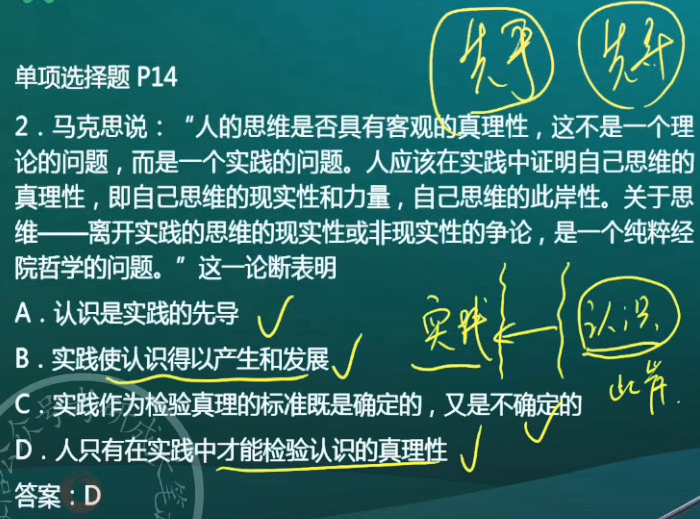
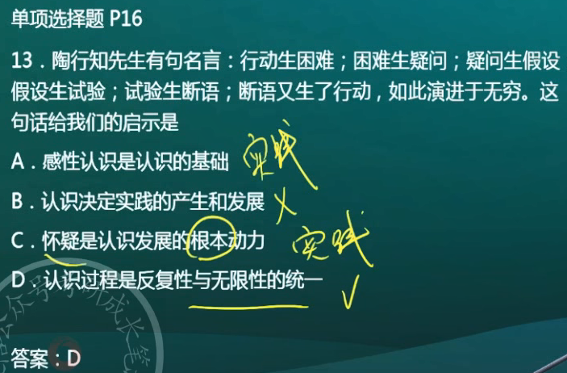
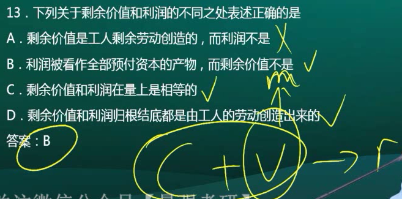
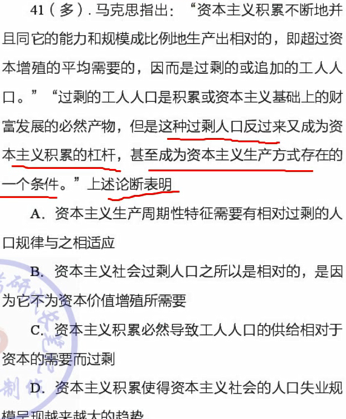
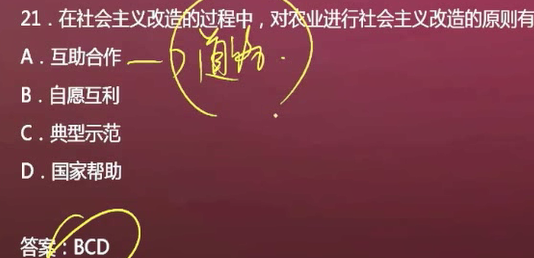
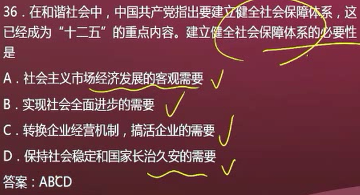
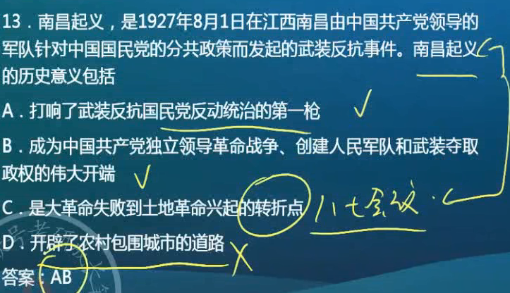
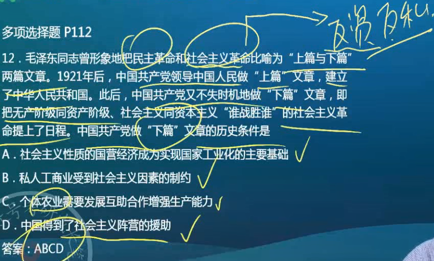
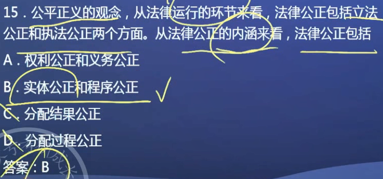

### 马原

1. 绪论

   1. ）马克思主义具有强大的生命力
      - 社会基本矛盾是人类社会发展的根本动力
      - 马克思主义鲜明特点：**实践性**、科学性、革命性、人民性、发展性
      - 马克思主义理论体系，包括科学社会主义（归宿）、**马克思主义哲学**（基础地位）、马克思主义政治经济学（主题内容）。没有“马克思主义社会学”

2. 马克思主义哲学

   1. ）旧唯物主义是“半截子”的唯物主义

      - 不彻底的唯心主义：二元论者——不可知论（否认物质与意识的同一性）
      - 不彻底的唯物主义（半截子）：自然观上唯物，历史观上唯心

   2. ）马克思的贡献

      - 哲学史上：辩证唯物主义和历史唯物主义
      - 理论上：唯物史观和剩余价值学说
      - 理论上的贡献使科学社会主义的诞生

   3. ）哲学基本问题

      - 区分
        - 辩证法和形而上学：世界是怎样存在的？ 孤立 片面静止 or 联系全面发展
        - 唯物史观和唯心史观：社会存在和社会意识何者为第一性

   4. ）客观规律性和主观能动性

      - 夸大规律：宿命论
      - 夸大能动：唯意识论

   5. ）唯物唯心总结

      - | 哲学派别             | 关键词                 | 代表人物             |
        | -------------------- | ---------------------- | -------------------- |
        | 古代朴素唯物主义     | 水、火气               | 荀子、赫拉克利特     |
        | 近代形而上学唯物主义 | 原子、粒子             | 牛顿                 |
        | 现代辩证唯物主义     | 客观实在               | 马克思、恩格斯、列宁 |
        | 主观唯心主义         | 我、吾、心、感觉       | 笛卡尔、王明阳       |
        | 客观唯心主义         | 理、道、宗教、绝对观念 | 柏拉图、黑格尔、朱熹 |

   6. ｝意识的作用

      - 意识能够改造/ 创造客观事物（都是对的）。例如意识可以将看到的一只鸡改造成香辣鸡块

   7. ）运动和静止

      - 时空是运动的存在方式
      - 运动的原因是矛盾
      - 运动的基础和承担着是物质

   8. ）时间

      - 客观性：不以人的意志为转移
      - 相对性：物质运动速度快时，时间会发生变化
      - 有限性：时间是有限的
      - 一维性：一去不返

   9. ）实践

      - 自觉能动性：受意识的指导，体现主观意愿——建楼前先画图，按图施工，才能建成
      - 直接现实性：要去做，不做没有用——图纸上的大楼，不去施工永远只在图纸上

   10. ）人类世界和自在世界分化和统一的基础——实践

   11. ）唯心主义哲学

       - 唯心主义同人类认识伴随始终（错的）

   12. ）物质的突出表现

       - 唯一特性：客观实在

   13. ）物质和意识的对立与统一

       > “物质和意识的对立只有在非常有限的范围内才有绝对的意义，超出这个范围，其对立便是相对的”

       **强调物质和意识的统一**

       意识根源于物质

       意识不能代替物质，物质不能代替意识（说得对，但不能选，因为在强调对立）

       一是可以转化为物质

   14. ）鬼神观念

       - 意识是外部世界的主观映象
       - 鬼神观念是人脑对客观世界的歪曲反映（对的）
       - 是人脑对鬼神的虚幻反映（错的，鬼神不是物质，不能对非物质进行反映；虚幻是对的）
       - 可以从人世间找到它的原型

   15. ）意识和反映

       - 意识的主体反映能力有差异，不能由头脑产生
       - 意识只是对客观存在近似的反映（对的，肯定了意识能动性的存在）。意识不能<u>准确地、完整地</u>认识这个世界（错的，这是不可知论）
       - 

   16. ）物质与认识的对立性

       - 

   17. ）实践活动

       - 实践活动地主体只能是**人**

   18. ）运动与静止

       - “人不能两次踏进同一条河流”——事物是变化发展的
       - “人连一次都不能踏进同一条河流”——诡辩论。否定了相对静止，夸大了绝对运动

   19. ）物质和运动

       - 

   20. ）认识

       - 

   21. ）辩证法三大规律

       - 

   22. ）矛盾

       - 

   23. ）外因与内因

       - 
       - 外因通过内因起作用

   24. ）新旧事物的发展

       - 

   25. ）自然规律和社会规律

       - 都有客观性
       - 自然规律：盲目、自发的、没有主观参与，可精确重复
       - 社会规律：有意识的，自觉的，主客观相互制约，只能趋势性地重复
       - 
         - ABCD说的都是对的，只有A是联系，BCD都是区别

   26. ）规律和能动

       - 

   27. ）看问题一分为二，分清主次

       - 

   28. ）事物间的联系

       - 

   29. ）矛盾

       - 矛盾解决的方法：
         - 一方客服另外一方
         - 双方协同运动
         - 转化为新的矛盾
       - 
       - 选ABC

   30. ）矛盾的同一性和斗争性

       - 
       - 同一性和斗争性都有可能起决定性作用

   31. ）量变和质变

       - 
       - D说的是对的，但不符合题意

   32. ）毛矛盾的普遍性和特殊性

       - 

   33. ）矛盾

       - 

   34. ）外因和内因

       - 
       - 近水楼台和向阳花木都体现的是外因

   35. ）偶然和必然

       - 
       - “守株”“待兔”都是现象，没有本质
       - 
         - A：必然性寓于偶然性之中
         - 答案：BCD

   36. ）实践和认识

       - 
       - 
       - 
       - 
       - 
       - 
       - 
       - 
       - 
       - 
       - 
       - 
       - 
       - 
       - 
         - 强调感性认识比理性认识更重要。感性认识和实践的侧重点是一致的，但他们不是一个东西。
         - 答案：ABD

   37. ）相对真理和绝对真理

       - 
         - B：日复一日，相对真理推翻一点留下一点汇总到一起才有今天的认知
         - 答案：ABCD
       - 
       - 同一范围内，真理就是真理，谬误就是谬误
       - 答案：CD

   38. ）价值评价

       - 
       - 
       - 自由的条件
         - 认识：认识越多越自由
         - 实践：
           - 遵循客观规律
           - 不牺牲别人的自由
       - 

   39. ）唯物史观

       - 
       - 
       - 
         - 都是正确的，但只选A
       - 
         - B：选项还原，主观是客观，所以错
         - C：唯物史观
       - 
         - “更重要”之类的，都是错的
       - 
         - 各种包括生产关系、精神关系等
       - 
       - 
         - A：唯物史观解决社会规律问题
         - B：一种力量决定，多种因素影响，而不是决定
       - 
       - 
         - D：前面“始终具有积极能动作用”错误，后面也不是题干种所说的被歪曲成的说法，题干中说的是“没有作用”而不是选项中的“消极作用”
         - 答案：ABC
       - 科技是现代生产的决定性力量，对的。其他关于科技的“决定性”都是错的。

   40. ）马克思主义政治经济学

       - 
         - D：社会全体成员就是“人民群众”，不包括“反动派”。
         - 答案：ABD

       - 

       - 

       - 

         - 可以增值，可以用钱去剥削别人

       - 

       - 

         - 重点问题是：为什么工资可以掩盖剥削

       - 

         - 具体劳动->使用价值->自然属性

         - 抽象劳动->价值->社会属性

         - 商品的价值量与生产商品所耗费的劳动时间成正比，与劳动生产率成反比

         - - |                            | 单位商品的价值量 | 相同时间生产商品数量 | 商品价值总量 |
             | -------------------------- | :--------------: | :------------------: | :----------: |
             | 社会（部门）劳动成产率增加 |       减少       |         增加         |     不变     |
             | 个别劳动生产率增加         |       不变       |         增加         |     增加     |

       - 

       - 
         - A：绝对向后延长，相对向前
         - B：相对缩短了，绝对没有
         - C：相对有技术的提高，绝对没有
         - D：相对是，绝对不是

       - 

       - 
         - 是否增持->A
         - 转移方式->C

       - 

       - 

       - 

         - D：书上没有，超纲

       - 

       - 

         - A：价值规律的表现形式

       - 

       - 

       - 

         - D同A

       - 

       - 

       - 

         - D：时而大时而小
         - 答案：ABC

#### 毛中特

1. 1

2. 毛泽东思想

   1. ）农村包围城市的革命道路理论
      - 初步形成：第一次国内革命战争时期-土地革命战争早期。《中国的红色政权为什么能够存在？》《井冈山的斗争》《星星之火，可以燎原》。
      - 毛泽东思想形成的标志：道路理论的提出
      - 最终确立：抗日战争时期。《战争与战略问题》
      - 毛泽东思想成熟的标志：新民主主义革命理论的系统阐述
      - 
   2. ）

      - 
        - 开始形成：大革命—土地革命
        - 走向成熟：遵义—抗日战争
        - 写入党章：中共七大
        - 继续发展：建国后
      - 
        - A：完成，错了
        - C：当时还没有中特
   3. ）实事求是的路线

      - 
        - 延安整风：全党确立了实事求是的路线
        - 答案：BCD
   4. ）活的灵魂和精髓（粗体是精髓）

      - 毛泽东：**实事求是**、群众路线、独立自主
      - 邓小平：**解放思想、实事求是**
   5. ）十一届六中全会

      - 对毛泽东和毛泽东思想进行了评价。《关于建国以来党的若干历史问题的决议》
      - 对社会主义初级阶段的主要矛盾作了表述：人民日益增长的物质文化需求同落后的生产之间的矛盾。
      - 第一次采用了“社会主义初级阶段”这个概念。系统整理->十三大
   6. ）中国革命的问题

      - 基本问题：农民问题
      - 首要问题：分清敌友的问题
      - 中心问题：无产阶级的领导权问题
   7. ）最根本的经验和最重要的环节

      - 
      - B：建国以后的事情
   8. ）统一战线

      - 
      - 
      - 
        - AC是可能性，
   9. ）中国社会的主要矛盾

      - 
      - 
      - 
      - 
        - 《论十大关系》
          1. 方针：C
          2. 根本思想：B
          3. 标志着马克思主义和中国具体实际的第二次结合
      - 
        - AB是新中国成立以前
   10. ）新旧民主主义革命
       -   
       -   - D说的是对的，但不是新的地方
       -   
           - C：土改完成**后**
           - D：说是主体地位，错的
   11. ）社会主义改造
       - 
         - A：道路
         - BCD是原则
       - 
         - C：反对帝国主义
   12. )党的建设
       - 
         - 小资不是资本主义，工农、小资是先进阶级

3. 邓三科

   1. ）当今世界所有问题的核心问题

      - 
   2. ）立论基础
      - 
        - A：中特是马列毛的发展
   3. ）解放思想，实事求是
      - 
        - 四个选项都对，但只有C在强调解放思想
   4. ）新民主主义社会和社会主义社会在经济基础上的区别
      - 
        - A：可以作为一个不是最好的备选选项
        - B：说法正确，但是是政治方面的
        - D：新民主主义时期已经执政
   5. ）社会主义的本质问题
      - 
      - 社会主义的根本任务——解放和发展生产力
      - 社会主义的根本目标——实现共同富裕
      - 社会主义的根本原则——共同富裕、公有制
      - 
        - C：不能只是修补，而要彻底改变
        - 制度
          - 资本主义
          - 社会主义
        - 体制
          - 市场经济
          - 计划经济
   6. ）社会主义现代化
      - 
        - 依据：国情
        - 根本保证：党的领导。没有党的领导就选某项制度
        - 重要保障：法律
        - 战略支撑：国防军队
        - 出发点、落脚点、归宿：和人有关
        - 立足点：独立自主，自力更生
   7. ）资源配置
      - 
   8. ）经济制度
      - 
        - A：是资本主义，具有资本主义性质
        - B：社会主义经济的组成只有一个：公有制经济
          - 改成<u>中国特色社会主义</u>或者<u>社会主义市场经济</u>，就是对的
   9. ）分配方式
      - 
        - 强调除了为主的按劳分配，多种方式并存的其他分配方式
        - CD是B的一种具体表现
   10. ）中国特色社会主义
       - 
         - B
           - 毛：革命、建设。**没有改革**
           - 邓三科：建设。**没有革命**
       - 
         - D：理论不能是“途径”，同理，理论也不能使保障。制度才能作为保障
       - 
         - AB->社会主义初级阶段的长期性->CD
         - 长期性取决于AB，决定了CD
       - 
         - B：不一定范围越大、程度越高越有助于，要优质，不要单一制
         - D：根本目的：共同富裕
       - 
         - A：社会矛盾才是社会发展的决定性力量和根本动力
         - 科技虽然不是生产力（劳动资料、劳动对象、劳动者）中一个单独的因素，但它可以和每一个要素结合
   11. ）对外开放
       - 
         - D：权宜之计：为了应付某种情况而暂时采取的办法。错的
   12. ）社会主义市场经济
       - 市场经济：没有制度属性
       - 社会主义市场经济：有制度属性
       - 
         - D：都是市场在资源配置中起决定作用。它是市场经济的一般特征
       - 
         - C：公有制经济居主体地位，在国民经济中起主导作用
       - 
   13. ）股份制
       - 
   14. ）按劳分配
       - 

4. 习近平新时代中国特色社会主义思想

   1. ）“四个全面”战略布局

      - 
        - 战略目标：C
        - 战略举措：ABD
      - 
   2. ）市场的作用

      - 
      - 
        - C：公共资源，错的
   3. ）习近平新思想

      - 核心要义：坚持和发展中国特色社会主义
   4. ）新常态

      - 
   5. ）供给侧改革
      - 
        - ABD：需求侧改革
   6. ）生态文明
      - 
        - 生态文明的理念：尊重自然，保护自然，顺应自然
      - 
      - 
   7. ）社会主义民主政治
      - 
        - 区别于西方的竞争性民主
      - 
      - 
   8. ）政治体制改革
      - 
        - 强调根本，即不能动
      - 
   9. ）文化事业和文化产业
      - 
      - 
        - 事业->社会效益
        - 产业->经济效益
        - 事业+产业->社会效益
   10. ）奋斗目标
       - 
         - 十二大：中特主义成为主题
         - 十三大：对中特理论作阐述
         - 十七大：提出了中特理论体系
   11. ）党的建设
       - 
         - **政治**（忠心）、思想（马克思主义思想）、组织（各层组织以及干部）、作风（理论联系实际，**密切联系群众**，批评与自我批评）、纪律、制度建设
       - 
       - 
         - 根本任务：解放和发展生产力
         - 总任务：社会主义现代化，中华民族伟大复兴
         - 党和政府的三大历史任务：祖国统一，社会主义现代化，世界和平
         - 党的历史使命：统揽四个伟大
           - 伟大斗争
           - 伟大工程
           - 伟大事业
           - 伟大梦想
       - 
         - C：讲的是理论，问题中重点是“管党治党”
   12. ）改革
       - 
         - B：平均用力、齐头并进，错了
       - 
         - 共同富裕要靠公有制经济来保障
       - 
       - 
   13. ）四个意识
       - 政治意识
       - 大局意识
       - 看齐意识
       - 核心意识
   14. ）扶贫
       - 
   15. ）政协
       - 
         - B：讲的不是民族平等
   16. ）民族区域自治
       - 
   17. ）现代化经济体系
       - 内容
         1. 创新引领、协同发展的产业体系
         2. 统一开放、竞争有序的市场体系
         3. 体现效率、促进公平的收入分配体系
         4. 彰显优势、协调联动的城乡区域发展体系
         5. 资源节约、环境友好的绿色发展体系
         6. 多元平衡、安全高效的全面开放体系
         7. 充分发挥市场作用、更好发挥政府作用的经济体制
       - 
   18. ）基层民主自治
       - 
       - 
         - B：基层管理，对的。国家管理，错的
   19. ）简政放权
       - 
         - D：拓宽权力职能，错的。
   20. ）分配
       - 
         - 答案ABD
         - C：初次分配
       - 
         - C： 提高低收入者收入，扩大中等收入者水平，调节过高收入，取缔非法收入
       - 
         - B：央企高管不是低收入者和中等收入者
         - 答案AD
   21. ）社会保障
       - 
   22. ）社会主要矛盾
       - 
       - 
         - CD：说得对，但不是依据
   23. ）一国两制
       - 
       - 
         - D：承诺放弃使用武力
   24. ）和平发展道路
       - 
   25. ）外交
       - 
   26. ）新阶层
       - 
         - 说法正确，但问题问的是原因，C为新阶层是什么样子的
       - 
   27. ）新时期的统一战线
       - 
   28. ）群众路线
       -  

#### 史纲

1. 旧民主主义革命时期

   1. ）国情

      - 国情->矛盾->任务->道路->路线
   2. ）洋务运动

      - 
      - 
        - 注意C
   3. ）戊戌变法

      - 
        - 资产阶级！
      - 
        - BC：革命派都是第二次
        - D：洋务派就是守旧派
      - 
        - D：感情色彩偏正面
      - 
        - A：相同之处
        - BCD：戊戌变法学、批判、主张君主立宪
   4. ）辛丑条约

      - 
   5. ）孙中山

      - 

        - 宋教仁被杀->二次革命
        - 袁世凯复辟->护国运动
        - 段祺瑞拒绝回复临时约法和国会->护法运动
        - D：还没有爆发辛亥革命之前
      - 
   6. ）革命派和改良派
      - 
        - A：第一次。洋务派和维新派
        - C：第二次
        - D：共同点。维新派想学君主立宪制，革命派想学共和制
      - 
        - 这是第一次
        - C：第二次
      - 
        - 力量弱小不是阶级局限性
   7. ）辛亥革命
      - 
        - B：中国同盟会
        - C：科学的，错的
      - 
      - 

2. 新民主主义革命时期
   1. 土地革命战争早期
      - 
        - BC：中共二大提出
          - 反帝反封建的纲领
          - 联系群众
        - D：大革命之前就解决了
        - 中共一大：建党，提出反对资本主义
        - 中共三大：国共合作或统一战线
        - 国民党一大：国共第一次合作
      - 
        - 若改为重要原因的多选题：ABCD
   2. ）世界无产阶级社会主义革命
      - 
   3. ）革命
      - 
        - 革命方法=群众路线
        - A：道路
        - B：指导思想
        - D：任务或纲领
      - 
        - C：八七会议
      - 
      - 
        - A：对待富农
          - 土地革命战争早期：限制
          - 抗日战争：允许富农收租
          - 解放战争：一般不变动，征收富农多余土地
          - 建国以后头三年的土改：保存
          - 社会主义三大改造：消灭富农剥削
        - B：三大改造才开始土地公有化
        - 答案CD
      - 
        - AB：土地革命早期
      - 
      - 
        - A：解决了军事问题、组织问题。瓦窑堡会议解决了政治问题，延安整风解决了思想问题
        - B：七大确定了
        - 答案CD
      - 
        - A：洛川会议
        - C：转折点
          - 大革命 - 土地革命——八七会议
          - 土地革命 - 抗日战争——西安事变
          - 抗日战争 - 解放战争——国民党进攻中原解放区（一般不考）
      - 1
        - 工农小资一定不是中间派
        - 大地主大资产阶级要么是敌人，要么是顽固派，也一定不会是中间派
   4. ）三民主义
      - 
        - 旧三民主义：民生概括为平均地权
        - 新三民主义：民生概括为平均地权、节制资本
   5. ）蒋介石、汪精卫
      - 
   6. ）会议
      - 
        - D：延安整风使这条思想路线在全党内得到确立
      - 
        - ABC都是延安整风的任务
      - 
        - B：即使到1949也只能说基本完成了
        - D：工作重心由农村转向城市
        - 
      - 
        - B：毛泽东活的灵魂
        - C：共产党三大优良作风
      - 
        - CD：八七会议都没解决
      - 
   7. ）左倾
      - 
        - 多选时：AB
      - 
        - 主观主义的表现形式：教条主义、经验主义
   8. ）统一战线
      - 
        - 民资是中间势力
      - 
        - A：老三民主义：精英化的民主
        - B：
          - 老：不反帝且反封不彻底。
          - 新：反帝反封建
        - C：都提出了
        - 答案：ABD
      - 
        - B：主观原因
      - 
        - C：工农小资民资，工农小资民资+大地主大资产阶级中的抗日派
        - D：第一次没有政权和军队合作
   9. ）新文化运动
      - 
   10. ）五四运动
       - 
         - B：五四运动->共产党成立->第一次国共合作->武装反抗国民党反动->八一南昌起义、秋收起义、广州起义->中心城市打不下来->探索新道路
   11. ）总结
       - 
       - 
       - 
       - 
       - 
       - 
       - 
       - 
       - 
       - 
       - 
       - 
       - 
       - 
         - C：把“减租减息”改变了
       - 
         - A：土地革命战争时期就采取过
       - 
       - 
       - 
       - 
         - C：都容纳了多党派参加
       - 
         - C：对同盟者又联合又斗争，错的

3. 新中国时期

   1. ）会议及讲话

      - 
      - 1
        - A：“两个务必”，七届二中全会
          - 务必使同志们保持谦虚谨慎、不骄不躁的作风
          - 务必使同志们保持艰苦奋斗的作风
   2. ）新中国成立
      - 
   3. ）社会主义三大改造
      - 
      - 
   4. ）监督
      - 
   5. ）矛盾
      - 
   6. ）思想路线
      - 
        - 思想路线
          - 抗日战争时期：《矛盾论》《实践论》中科学阐述
          - 延安整风：全党范围内确立
          - 文化大革命：歪曲
          - 重新确立：十一届三中全会
        - 答案：BCD

#### 思修

1. 思想修养

   1. ）理想

      - 
      - 
        - D：题干：周恩来提出的。当时没有中华民族伟大复兴的说法
   2. ）观念

      - 
      - 
        - ABC不能贯穿古今
      - 
      - 
        - 题干说的是钱学森个人
   3. ）民族精神
      - 1
        - 十九大新提出的民族精神
          - 伟大的梦想精神
          - 伟大的团结精神
          - 伟大的奋斗精神
          - 伟大的创造精神
   4. ）物质生活和精神生活
      - 
      - 
   5. ）人生目的、人生态度、人生价值
      - 
        - 世界观太大了
        - 世界观
          - 人生观
            - 目的
            - 态度
            - 价值
          - 价值观
   6. ）个人与社会
      - 
        - A：对立统一关系，不能只说统一
      - 
      - 
        - A：衡量社会价值看的就是贡献
        - C：题干问的是社会价值，选项说的是人生价值
   7. )核心价值观
      - 
        - 理想是未来的，而核心价值观是现在所提倡的
      - 
        - C：当没有国家时，也就没有了爱国主义

2. 道德修养

   1. ）道德

      - 

      - 

        - 道德的功能

          - 认识——行为前

          - 规范——行为中

          - 调节——行为后

            - > 道德通过评价等方式，指导和纠正人们的行为和实践活动，协调社会关系和人际关系

      - 

        - 重点是诚实守信

      - 

        - 职业道德
          - 最低：爱岗敬业
          - 最高：奉献社会

      - 

      - 

      - 

        - 完全可以把经济关系改成经济基础，把道德改成上层建筑

   2. ）时代特征

      - 

   3. ）基本国策

      - 毛中特
        - 对外开放
        - 一国两制
        - 保护环境
        - 节约资源
      - 思修
        - 男女平等（道德要求，法律要求，基本国策，但不是政治要求）
      - 爱国主义（道德要求，法律要求，政治要求）

   4. ）道德和法律

      - 
        - D：法律对道德作用，与题干相反
      - 
        - 《公民道德建设实施纲要》第一个是“爱国守法”
        - 《公共生活》第一个是“遵纪守法”
      - 
        - D：在古代就是存在的，不是进步的表现
      - 
        - 法律的作用
          - 指引
          - 评价
          - 强制D
          - 教育
          - 预测
      - 
        - A：和公共秩序无关
        - D：不涉及到遵纪守法
      - 
        - A
          - 个人品德：自身
          - 公共道德：社会成员之间和社会关系秩序

   5. ）社会主义核心价值观

      - 道义力量
        - 
        - 内容
          - 先进性：C
          - 人民性：B
          - 真实性：D
        - A：可以是力量、源泉，但不是实践

   6. ）传统美德

      - 

   7. ）为人民服务

      - 
        - A：社会主义的道德要求

   8. ）公共生活

      - 
        - C：生活质量，对的。物质生活质量，错的；不能保证物质丰富

3. 法律基础

   1. ）法律
      - 
        - A：统治者的整体意志
        - B：整体 != 部分之和
        - C：可能还在政策、领袖讲话等之中
      - 
      - 
        - 宪法的基本原则
          - 党的领导原则
          - 人民主权原则
          - 人权保障原则
          - 法治原则
          - 民主集中制原则
      - 
      - 
        - C：没有法律判决一律平等的说法
        - D：司法过程中
      - 
        - E：教育作用。也选
      - 
      - 
        - C：涉及法院、检察院
      - 
        - C：1/5以上提议，2/3以上通过
      - 
        - AC：资本主义也是这样的
        - 题干：我国社会主义法律所特有的
      - 
        - C：党内法律、机关、纪委等保障
        - 国家机关
          - 行政机关，简称政府。在我国行政系统中,国务院居于最高领导地位
          - 司法机关，法院、检察院
          - 军事机关
          - 权力机关
          - （政协机关不属于）
        - 答案ABD
      - 
        - 注意D
      - 
        - C：仲裁机关和调节机关的权利
      - 
   2. ）全国人民代表大会
      - 
        - 全国人民代表大会
          - 最高权力机关
          - 决定其他所有制度的产生
          - 监督所有机关的工作
          - 行使立法权
   3. ）法律
      - 
        - 法律部分：由一些法律组成
          - A：属于行政法部门
          - C：属于社会法部门
          - D：属于民法商法部门
        - 六大实体法律部门
          - 宪法相关法
          - 民法商法
          - 行政法
          - 经济法
          - 社会法
          - 刑法
        - 两大程序法律部门
          - 诉讼程序法
          - 非诉讼程序法
      - 
        - 中国特色社会主义法律体系中
          - 宪法：统帅
          - 法律：主干
        - AD都属于B
      - 
      - 
      - 
      - 
        - 选项对应着：立法、执法、司法、守法
      - 
      - 
   4. ）权利和义务
      - 
        - 教育和劳动，即使权力也是义务
      - 
        - A：有权利就会有相应的义务
        - B：有多大的权利，就有多大的义务
      - 
        - C：（保留自己的意见）
   5. ）司法

      - 
   6. ）法治和人治

      - 

        - AB是在依据上的体现
   7. ）仲裁
      - 
        - 解决纠纷的方法
          - 调节（多个环节都可以）
          - 仲裁（仲裁有结果了就不能再更改了，甚至不能诉讼）
          - 诉讼
      - 
        - 行政复议：与政法机关
      - 
      - 
   8. ）两种排除犯罪的事由

      - 
   9. ）继承
      - 
   10. ）住宅安全权
       - 
