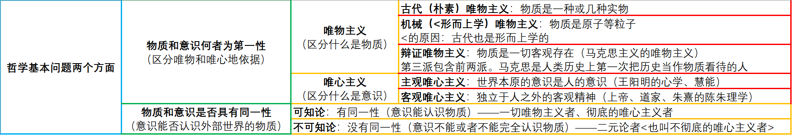

### 1、绪论

1. 马原(24`)

   - 总论
   - 哲学(18`)
     - 哲学基本问题
     - 唯物论
     - 辩证法
     - 认识论
     - 唯物史观
   - 政治经济(a) 
   - 科社(6-a)
   - 重点：
     - 世界的物质性及发展规律
     - 实践和认识及发展规律
     - 资本主义的认识和规律

2. 毛中特（变化很大）

3. - 重点
     - 二、新民主主义革命理论
     - 三、社会主义改造理论
     - 四、社会主义建设道路初步探索的理论成果
     - 八、习近平新时代中国特色社会主义思想
     - 十、“五位一体”总体布局
     - 十一、“四个全面”战略布局
     - 十三、中国特色大国外交

4. 中国近代史（小变化，新增的也在毛中特里）

5. 马克思主义的产生

   |                  |                       马克思主义的产生                       |
   | ---------------- | :----------------------------------------------------------: |
   | 经济社会历史条件 |                      资本主义经济的发展                      |
   | 实践基础         |                  无产阶级反对资产阶级的斗争                  |
   | **理论来源**     | **德国古典哲学 \| 英国古典政治经济学 \| 英法空想社会主义理论的合理成分** |

6. 马克思主义的发展

7. <u>马克思主义生命力根源/基本和最鲜明的特征</u>：实践性、科学性、革命性、人民性、发展性

   - 独有的特征：实践性、科学性

8. |                                  |                                                              |
   | -------------------------------- | ------------------------------------------------------------ |
   | 无产阶级的最根本的世界观和方法论 | 辩证唯物主义与历史唯物主义                                   |
   | 最鲜明的政治立场                 | 马克思主义政党地一切理论和奋斗都应致力于实现<u>以劳动人民为主主体地最广大人民的根本利益</u> |
   | 最重要的理论品质                 | 坚持一切以实际出发，理论联系实际，实事求是，在实践中检验真理和发展真理 \| 与时俱进 |
   | 最崇高的社会理想                 | 物质财富极大丰富、人民精神境界极大提高、每个人自由而全面的发展 |

9. 马克思主义的当代价值：

   - 观察当代世界变化的认识工具
   - 引领社会进步的科学真理
   - 指引中国当代发展的行动指南

10. 2008年国际金融危机以来资本主义的矛盾和冲突（有可能结合6考分析题）

11. <u>普世、普世都是错误的！</u>

### 2、总论和哲学基本问题

1. 哲学基本问题及不同哲学流派
   - 思维与存在的关系 | 意识与物质的关系
   - 三大唯物主义、两大唯心主义
   - 可知论和不可知论
   - 辩证法和形而上学

2. 马克思两大贡献：**<u>创立</u> 历史唯物主义（唯物史观）、<u>形成</u> 辩证唯物主义**

3. 

4. 世界是怎样存在的

   - 形而上学：孤立、片面、静止、无矛盾的

   - 辩证法：联系、全面、发展、矛盾

### 3. 马克思主义理论

1. 马哲
   - 唯物论：世界是物质的
   - 辩证法：联系、全面、发展
   - 认识论
   - 唯物史观

2. 唯物论
   - 物质观
     - 【7-2】物质范畴——物质概念
       - 定义：物质是标志客观存在的哲学范畴，这种客观实在是<u>1.人通过感觉感知的。**2.他不依赖于我们的感觉而存在。**3.为我们的感觉所复写、摄影、反应。</u>
       - 定义方式：借助物质与意识的关系（..感觉..）
       - 物质的唯一特性：客观实在（我对你的好感不属于物质，因为我不想就没有）
     - 【8-2】物质与运动
       - 运动的定义：运动是标志一切事物和现象的变化及其过程的哲学范畴。运动是物质的**存在方式**和**根本属性**。
         - **变化就是运动。**
       - 物质和运动的关系：**不可分割**。一方面，物质是运动着的物质。另一方面，运动是物质在运动。
       - 方法论的意义：脱离物质谈运动->唯心主义，脱离运动谈物质->形而上学
       - A和B是不可分割的：我是你的我，你是我的你。（百试不爽）
       - 词性一致->“对立统一”，词性不同->“不可分割”。
     - 【9-2】运动与静止
       - 静止的定义：静止时物质运动再一定条件下的稳定状态，包括**空间位置**和**根本性质**<u>暂时</u>未变这样两种运动的特殊状态。
       - 运动和静止的关系：**对立统一**。相互区别：运动是<u>绝对的、无条件的</u>，静止时相对的、<u>有条件的</u>。相互联系：相互依赖、相互渗透、相互包含，动中有静、静中有动。
       - 方法论的意义：夸大静止，否定运动->形而上学；夸大运动，否定静止->诡辩论
       - “人不能两次踏进同一条河”（人与河都在变化），这句是对的，有萌芽的辩证法思想。
     - 【10-2】物质运动与时空
       - 定义：时间是指物质运动的持续性、顺序性，特点是一维性，即一去不复返。空间是指物质运动的广延性、伸张性，特点是三维性。
       - **运动**是物质的存在方式，**时（间和）空（间）**是运动的存在方式。
       - 时空的特点：
         - 客观性：不以人的意志为转移
         - 绝对性：时空是绝对存在的
         - **相对性**：随着运动的速度变化，会导致时空的变化
         - 有限性：具体时空是有限的
         - 无限性：整个宇宙是无边无际的
       - 物质运动与时空的关系：**不可分割**。

   - 意识观

     - 【11-2】意识的起源

       - 本质：1.物质世界长期发展的产物。2.人脑的基能和属性。**3.物质世界的主观映象**。
       - 起源：由1.一切物质所具有的反应特性到低等生物的刺激感应性，2.再到高等动物的感觉和心理，3.最终发展为人类的意识。在此过程中，劳动起了决定性作用，语言是重要影响。**意识是人独有的。**

     - 【11-2】意识的本质

       - 语言是意识的物质外壳。语言是物质，语言的含义是意识。

     - 【11-3】意识的作用——能动作用

       ```
       意识反映世界具有自觉性、目的性和计划性
       意识是具有创造性
       意识具有指导实践改造客观世界的作用
       意识具有指导、控制人的行为和生理活动
       ```

     - 【11-2】物质和意识的辩证关系（对立统一关系）

       - 物质和意识相互区别：1.物质是本源，意识是派生。2.物质不是意识，意识不是物质。（形而上学认为：意识也是物质）。3.物质不能代替意识，意识不能代替物质。
       - 相互联系：1.物质可以转化为（变成）意识，反之亦然。2.意识对物质既有依赖性，又有相对独立性。3.物质决定意识，意识反作用于物质。

     - 【12-2】主观能动性和客观规律性的统一

       - 1.关系

         - **必须尊重客观规律**。发挥人的主观能动性必须以成人规律的客观性为前提。
         - **在尊重客观规律的基础上，要充分发挥主观能动性**。承认规律的客观性，并不是说人在客观规律面前是无能为力的，人们通过自觉活动能够认识规律和利用规律。实践是客观规律性与主观能动性相统一的基础。
         - 只尊重规律却不发挥主观能动性，事情能做的成，但是没有意义。只尊重能动，事情可能很有意义，但做不到。

       - 2.发挥主观能动性的作用（根据主观能动性与客观规律的关系原理，人们要正确发挥主观能动作用）

         1） 从实际出发，努力认识和把握事物的发展规律。

         2）实践是发挥人的主观能动性的作用途径。

         3）主观能动性作用的发挥，还依赖于一定的物质条件和物质手段。

     - 【13-2】世界的物质统一性原理及其意义

       1）世界是统一的，即世界的本原是一个。*可批判“二元论”，不能批判“唯心主义”。*

       2）世界的统一性在于它的物质性，即世界统一的基础是物质。*+1）可批判“唯心主义”，但不能批判“旧唯物主义”（古典朴素+机械）*

       3）物质世界的统一是多样性的统一，而不是单一的无差别式的统一。*+1）+2）才是马哲*

     - 【13-2】人类社会的物质性（不要求深入）

       - 人类社会依赖于自然界是整个物质世界的组成部分
       - 人类谋取物质资料的实践活动，虽然由物质的指导，但仍然是物质的活动
       - 物质资料的生产方式，是人类存在和发展的基础，集中体现着人类社会的物质性

     - 【13-3】世界的物质统一性原理（人/党从实际出发并取得成功的故事）

       ```
       马克思主义的理论意义：是马克思主义哲学的基石，马哲的一系列原理和原则都是以此为根据和前提的，从而成为彻底的唯物主义一元论的世界观。
       实践意义：是我们从事一切工作的立足点，是一切从实际出发的思想路线的哲学基础。
       ```

###4.辩证法的两大总特征

1. 辩证法

   - 两大总特征：世界是普遍联系，永恒发展的

   - 五对范畴：解决事物联系和发展的环节上的逻辑问题

     - 原因和结果
     - 必然和偶然
     - 现象和本质
     - 内容和形式
     - 可能和现实

   - 三大规律（回答怎样联系、如何发展）

     1）对立统一：联系的内容，发展的动力

     2）质量互变：发展的过程和状态

     3）否定之否定：发展的方向和归宿

2. 两大总特征：

   1）普遍联系

   - 【14-2】联系的含义

     - *事物内部各要素之间和事物之间相互影响、相互制约和相互作用的关系。*辩证法要求在区别中看到联系，在练习中看到区别。（主观唯心主义哲学家-王阳明-知行合一，错的：只讲联系，不讲区别。知行统（同）一，对的。）

   - 【14-2】联系的特征

     1>客观性：联系是客观存在的，不因主观转移

     2>普遍性：时时有联系，处处有联系。每个事物都通过中介与他物联系；同时也是他物联系的中介

     3>多样性：联系是多样的，例如“直接联系”和“间接联系”

     4>条件性：1.条件对事物发展和人的活动具有支持或制约所用；2.条件是可以改变的，人们经过努力可以创造出事物发展所需要的条件；3、改变和创造条件不是任意的，必须要尊重事物发展的客观规律

   - 系统的观点*（系统：由相互联系、相互作用的若干要素组成的具有<u>稳定结构</u>和<u>特定功能</u>的有机整体）*

     - 系统具有**整体性**、结构性、层次性、开放性。

     - 系统的整体性

       1>整体具有部分所不具备的新功能

       2>脱离了整体的部分将丧失原有的功能


   2）永恒发展

   - 【15-2】发展的含义

     - 发展是：前进的上升的运动，发展的实质是新事物的产生和旧事物的灭亡。
     - **运动 = 变化 > 发展**（运动可以前进也可以倒退，变化可以朝好的或者坏的方向变化，前进且朝好的方向发展才叫发展。不能说发展是绝对的，但是永恒的——大方向上越来越好）

   - 【15-2】新、旧事物的关系

     - 新事物是值合乎历史前进方向、具有远大前途的东西；旧事物实质丧失历史必然性、日趋灭亡的东西，**新生事物是不可战胜的**

       ```
       新事物具有新结构，适应新环境
       新事物是旧事物的改良，吸收了旧事物的优点，增添了新内容
       新事物符合群众利益，受到群众拥护
       ```

     - 命题角度：如何区分新旧事物？新旧事物的区分是否与时间的先后有关？

       - 新事物**一定**产生于旧事物之后（错的，X）。含义中没有提到时间。
       - 新事物**往往**产生于旧事物之后（对的）

   - **过程**的观点（以下都符合）

     - 世界不是既成事物的集合体，而是过程的集合体
     - 一切在历史上产生的都要在历史中灭亡
     - 任何事物都有他的过去、现在和将来

###5.辩证法的五对范畴（关系都是对立统一的）

1. 【16-2】原因和结果

   1）概念：揭示事物的<u>前后相继</u>、彼此制约的关系范畴（因果是前后相继的，但前后相继的并不一定是因果的）

   - 原因是引起某种现象的现象
   - 结果是被某种现象引起的现象

   2）关系：**对立统一**

   ​	1>原因和结果的区分既是确定的，有时不确定的（单说确定或不确定都是 错的）

   ​	2>原因和结果相互作用，原因产生结果，结果反过来影响原因，互为因果

   ​	3>如银河结果相互渗透，结果存在于原因之中，原因表现在结果之中

   ​	4>原因和结果的关系是**复杂多样**的，有一因多果、同因异果、一因多果、异因同果、多因多果、符合因果 

   ​	<u>“有起因必有其果”错的。“公说公有理，婆说婆有理”错的，违背了真理的一元性。</u>

   3）方法论

   - 凡事预则立不预则废

   4）**考研哲学中，不可分割关系：物质和运动，物质运动和时空**

2. 【17-2】必然和偶然

   1）概念：揭示客观事物发生、发展、灭亡不同趋势的范畴

   - 必然性是值事物联系和发展过程中一定要发生、确定不移的趋势
   - 偶然性实质事物联系和发展过程中并非确定发生的趋势

   2）关系：对立统一

   - 相互区别：他们产生和形成的原因不同，必然性往往产生于内部原因，偶然性往往有外部原因；表现形式不同，必然性表现出稳定，偶然性表现出不稳定；在事物发展中的地位和作用不同，必然性往往起到决定性作用，偶然性起到重要的影响作用
   - 相互联系：1.必然性寓于偶然性之中，通过大量的偶然性变现出来，并为自己开辟道路；2.偶然性背后隐藏着必然性，受必然性的支配，偶然性是必然性的表现形式和补充；必然性和偶然性在一定条件下可以相互转化

   3）方法论：我们要重视事物发展的必然性，把握事物发展的总趋势，又要善于从偶然中发现必然，把握有利于事物发展的机遇。必然就是规律，偶然就是机遇。

3. 【18-2】可能性和现实性

   1）概念：可能性和现实性是揭示事物的过去、现在和将来的相互关系的范畴。

   - 可能性是指事物发展过程中潜在的东西，是包含在食物中并预示事物发展前途的种种趋势
   - 现实性是指已经产生出来的有内在根据、合乎必然性的存在

   2）关系：对立统一

   - 相互区别：略（区别在概念上）

   - 相互联系：没有现实就没有可能，反之亦然，他们在一定条件下可以相互转化。

   - **命题角度**：
     - 区分可能性何不可能性
     - 现实的可能性和抽象（不现实）的可能性
     - 好的可能性和坏的可能性

   - | 区分可能和不可能 | 在现实中是否有依据 |
     | ---------------- | ------------------ |
     | 有               | 可能性             |
     | 没有             | 不可能性           |

     | 区分现实的可能和抽象的可能 | 在现实中是否有依据是否充分 |
     | -------------------------- | -------------------------- |
     | 充分                       | 现实的可能                 |
     | 不充分                     | 抽象的可能                 |

     - 现实的可能和抽象的可能都是“可能”，而不是“不可能”。
     - 现实的可能和抽象的可能都是“可能”，而不是“现实”。现实是已经发生的事情。

   - 方法论：要求人们立足现实，展望未来，注意分析事物发展的各种可能，发挥主观能动性，做好应对不利情况的准备，争取实现好的可能。

4. 【19-2】现象和本质

   1）概念：揭示客观事物的外部表现和内部联系相关关系的范畴。

   - 现象是事物的外部联系和表面特征，人们可通过感官感知。
   - 部分中冲则是事物的内在联系和根本性质，只有靠人的理性思维才能把握。

   2）关系：对立统一

   - 相互区别：现象是个别、具体的，，本质是一般、共同的。现象是多变的，本质是相对稳定的。现象是生动、丰富的，本质是深刻、单纯的。
   - 相互联系：任何本质都是通过现象表现出来，没有不表现为现象的本质；任何本质都从一定方面表现着本质，现象是本质的外部表现，即使是假象也是本质的表现。
     - 假象：<u>客观</u>但虚假的现象；错觉：<u>主观</u>感受上的错误
     - 错觉可能由假象导致（有可能主管神经紊乱导致错觉）

5. 【20-2】内容和形式

   1）概念：揭示事物内在要素同这些要素的结构和表现方式的关系范畴

   - 内容是构成事物一切要素的总和，是事物存在的基础
   - 形式是内容诸要素相互结合的结构和表现方式。内容和形式是相互依赖、不可分割的

   2）关系：对立统一

   - 相互区别：略
   - 相互联系：任何事物的内容都有一定的形式，任何形式也都有一定的内容，没有无内容的空洞的形势，也没有无形式的纯粹的内容。
     - **内容决定形式，形式反作用于内容**。当形式适合内容时，对内容的发展起着积极的推动作用；不适合时，起着消极的阻碍作用。

   3）方法论：既要重视内容，根据内容的需要决定形式的取舍，改造和创新；又要善于运用形式，发挥其积极作用，利用和创造必要的形式，适时地抛弃与内容不相适应的形式。

   ###6.对立统一规律

   <u>对立统一和矛盾可替代使用。</u>

   1. 【21-2】**唯物辩证法的实质和核心**

      1）<u>对立统一规律解释了食物普遍联系的根本内容和永恒发展的内在动力，从根本上回答了事物为什么会发展的问题</u>

      2）对立统一规律是贯穿其他规律和范畴的中心线索

      3）对立统一规律提供矛盾分析法，它是对事物辩证认识的实质

      4）是否承认对立学说是唯物辩证法和形而上学对立的实质

   2. 【21-3-3】同一性和斗争性的辩证关系原理

      1）概念：（<u>同一和斗争不是时而时而的关系，而是既又的关系</u>）

      - 矛盾的<u>同一性</u>是指矛盾双方相互依存（没有一个，另外一个很难存在）、相互贯通（可以相互变成对方，例如上和下、强和弱）的性质和趋势
      - 矛盾的<u>斗争性</u>是矛盾着的对立面之间相互排斥、相互分离的性质和趋势。由于矛盾的性质不同，矛盾的斗争性质不同，矛盾的斗争性也不同，对于多种多样的斗争形式，可以区分为对抗些和非对抗性两种基本形式
      - 人民民主专政：对待人民（内部矛盾）就民主，对抗敌人就专政
      - <u>辩证关系 = 矛盾关系 = 对立统一关系 = 斗争同一关系</u>：相互区别又相互联系

      2）同一性和斗争性的关系：对立统一

      - 相互联系。矛盾的同一性和矛盾的斗争性是相互联结、相辅相成的，没有斗争性就没有同一性，斗争性寓于同一性之中，没有同一性也就没有斗争性。
      - 相互区别。在事物的矛盾中，矛盾的斗争性是无条件的绝对的，矛盾的同一性是有条件的相对的。
      - 方法论意义：“看问题要一分为二”；“求同存异”；“批判地继承”；“事物之间会相互转化”

   3. 【21-3-3】同一性和斗争性在事物发展中的作用原理

      1）矛盾的同一性在事物发展中的作用表现在：

      ​	1>由于矛盾双方相互依存，互为存在的条件，矛盾双方可以利用双方的发展使自己得到发展

      ​	2>同一性使矛盾双方相互吸引有利于自身的因素，在相互作用中各自得到发展

      ​	3>由于矛盾双方彼此相通，矛盾双方可以想着彼此的对立面转化而得到发展，并规定事物的发展方法。（你强我弱，后面我超过了你变强了，我变得比你的强还要强）

      2）矛盾的斗争性在事物发展中的作用表现在：

      ​	1>矛盾的双方的斗争促进矛盾双方力量的变化，竟长争高，此消彼长，造成事物的量变。

      ​	2>矛盾双方的斗争，促使矛盾双方的地位和性质发生转化，实现事物的质变。

      3）方法论：

      - 事物的发展不仅表现为“相反相成”（斗争性占主要作用），而且表现为“相辅相成”（同一性占主要作用）
      - 学会从事物的对立面把握事物的统一，逆向思考
      - 和谐不是无差别的一致

   4. 【21-3-2】内因和外因的辩证关系原理

      1）概念：事物的内部矛盾是事物发展的内因；外部矛盾就是外因

      2）关系：对立统一

      - 相互区别：内因即内部矛盾是事物存在的基础，是事物发展的根本原因，外因是事物变化的条件，它能够加速或延缓是否正常暂时改变事物发展的进程，是事物发展的第二位的原因。（内因更重要）
      - 相互联系：外因必须通过内因而起作用，二者共同推进事物的发展

      3）方法论：事物发展是由内因决定的，并受外因影响

   5. 【21-3-3】普遍性（共性）和特殊性（个性）的辩证关系原理

      1）概念：

      - 矛盾的普遍性是指矛盾存在于一切事物中，存在于一切事物发展过程的始终，就的矛盾解决了，新的矛盾又产生了，事物始终在矛盾中运动

      - 矛盾的特殊性是指具体事物在其运动中的矛盾及每一矛盾的各个方面都有其特点。矛盾的特殊性由三种情形

        1不同事物的矛盾各有其特点

        2同一事物的矛盾在不同发展过程和发展阶段各有不同特点

        3规程事物的诸多矛盾以及每一矛盾的不同方面各有不同的性质、地位和作用

      2）关系：

      - 相互区别：矛盾的共性是无条件的，绝对的，矛盾的个性是有条件的、相对的、相互联系的

      3）方法论意义：“具体问题具体分析”，对症下药，量体裁衣

   6. 矛盾的不平衡发展原理

      1）概念：主要矛盾和次要矛盾；矛盾的主要方面和次要方面

      2）原理：事物的性质是有主要矛盾的主要方面决定的

      3）方法论意义：“两点论”与“重点论”相结合；抓关键看主流

   7. 矛盾分析法（方法论总结）

### 7.【22-2】质量互变定律

1. 概念。

   - 认识质是认识和实践的起点和基础，只有认识质，才能区别事物
   - 量的意义：
     - 认识事物的量是认识的深化和精确化
     - 只有正确了解食物的量，才能正确估计事物在实践中的地位和作用
   - 量变：<u>数量增减</u>和<u>次序变动</u>。保持事物的质的相对稳定性的<u>不显著变化</u>，体现了事物渐进过程的<u>连续性</u>
   - 质变：事物性质的<u>根本变化</u>，是事物由一种质态向另一种质态的飞跃，体现了事物<u>渐进过程和连续性的中断</u>

2. 关系。

   - 相互区别：略

   - 相互联系：

     1>量变是质变的<u>必要</u>准备（激变论：不需要量变就可质变，夸大质变，否定量变）

     2>质变是量变的<u>必然</u>结果（庸俗进化论：夸大量变，否定质变）

     3>量变和质变是相互渗透的

     - 一方面，在两边的过程中也有阶段性和局部性的部分质变
     - 另一方面，在质变过程中也有旧质在量上的收缩和新质在量上的扩张

3. |      理论上的方法论      |                   实践中的方法论                   |
   | :----------------------: | :------------------------------------------------: |
   |   夸大质变导致：激变法   |                      适度原则                      |
   | 夸大量变导致：庸俗进化论 | 对<u>社会主义</u>（质）<u>初级阶段</u>（量）的认识 |
   |                          |                  改革、发展和稳定                  |

### 8.【23-2】否定之否定规律

1. 辩证否定观

   - 肯定因素
   - 否定因素
   - 基本内容
   - - 否定是事物的<u>自我否定</u>（形而上学：外在力量对事物进行否定。踩死毛毛虫是偶然而不是必然。辩证法研究的是本质的规律）
     - 否定式事物发展的环节
     - 否定是新旧事物联系的环节
     - 辩证否定的<u>实质是“扬弃”</u>，即新事物对旧事物即批判又继承，即克服其消极因素又保留期积极因素（形而上学：肯定一切或肯定一切）

2. 否定之否定规律

   - 事物的辩证发展是经过两次否定，三个阶段，形成一个周期。其中否定之否定阶段仿佛是向原来出发点的“回复”，但这是在更高阶段的“回复”， 是“扬弃”的结构
   - 迂回前进、螺旋上升

3. 方法论


|         理论上的方法论         | 实践中的方法论 |
| :----------------------------: | :------------: |
| 只看到回归，没看到发展：循环论 |  前途是光明的  |
| 只看到发展，没看到回归：直线论 |  道路是曲折的  |

4. “四个全面”战略布局和新发展理念对唯物辩证法的创造性运用

   - “四个全面”在各个方面都体现了唯物辩证法思想

     1）体现了事物联系和发展的思想

     2）辩证法要求我们用整体的、全面的观点看问题

     3）在唯物辩证法的方法论题型中，矛盾分析方法居于核心地位，是根本的认识方法，“四个全面”思想也是矛盾分析方法的具体体现

   - 党的十八届五中全会提出了创新、协调、绿色、开发、共享的新发展理念，集中反映了我们党对经济社会发展规律认识的深化。实施新的发展理念，要坚持系统的观点，要坚持“两点论”和“重点论”，要遵循对立统一规律、质量互变定律、否定之否定规律，要坚持具体问题具体分析

5. 主观辩证法和客观辩证法都是唯物辩证法。

   - 客观辩证法才去外部必然性形式
   - 主观辩证法则采取观念的、逻辑的形式

###9.认识论

1. 【26-2】认识的来源

   1）实践和认识分不开的，认识来源于实践。实践的本质：**人类能动地**改造世界的**客观物质性**活动。

   - 实践的主体只能是人。机器人不能代替人进行实践活动。实践客观上还是物质。物质和意识是通过实践联系起来的。

   2）实践的基本特征：

   - 直接现实性：将“脑中的”变成“现实的”
   - 自觉能动性：受意识的指导，体现主体的目的性
   - 社会历史性：不同历史阶段的实践内容不同

   3）实践的基本形式

   - 物质生产劳动实践——劳动
   - 社会政治实践——处理人与人之间的关系
   - 科学文化实践——探索

   4）人的活动

   - 本能活动
   - 实践活动

   5）主体、客体和中介

   - 不是所有的人都是主体
   - 主体有自主性和能动性，客体和中介都是被动的
   - 主体的能力：
   - - 自然能力
     - 精神能力
     - - 知识性因素
       - 非知识性因素
   - 实践主体
   - - 个体主体
     - 群体主体
     - 人类主体

   6）客体

   - 客体是物，但不是所有的物都是客体。实践和认识活动所指向的对象

   7）中介

   - 物质性工具系统

   8）主客体的关系

   - **实践关系——最根本的**。实践的主体客体与认识的主体客体在本质上是一致的
   - 认识关系
   - 价值关系

   9)主客体相互作用的主要环节

   - 定目标——确立实践目的和时间方案
   - 付诸实施——把实践方案变为实际的实践活动
   - 调结果——通过反馈和调节，使实践目的、手段和结果按一定方向运行

   10)【23-3】实践决定认识

   ```
   实践是认识的来源。首先，实践产生了认识的需要。其次，实践还为认识的形成提供了可能
   实践是认识的动力
   实践是检验认识是否正确的标准
   时间是认识的目的
   ```

   ```
   实践（决定性作用）->认识
   间接经验（重要影响作用）->认识
   生理因素（重要影响作用）->认识
   ```

   11）【23-3】认识对实践的指导作用

   - 原因：1、2

     ```
     实践必须受意识支配，这决定了它离不开认识的指导
     认识的成果具有相对独立性，它一经形成，能够指导实践
     认识指导实践表现在很多方面：找规律，定目标，选方式，创理论，改自身
     认识反作用于实践有两种情况：促进实践，阻碍实践
     ```

   12）【23-3】理论：认识的高级形式

   - 理论是对事物本质和规律的认识，它可以而且应该走在实践的前头，指导实践的进程
   - 科学理论能预见未来，端正时间的方向
   - 科学理论作为一种精神力量，能推动人们在实践中创新

   13）【23-3】重点知识

   - **实践决定认识；认识反作用于实践**
   - **实践先于认识；认识是实践的先导**（指导）
   - **实践高于认识，实践与认识具有同一性**（不能说实践比认识更重要，但可以说更高级；物质比意识高级），**合一性是错的**

2. 【29-2】认识的本质和过程

   1）

   | 唯心主义先验论                             | 唯物主义反映论                                         |                                                              |
   | ------------------------------------------ | ------------------------------------------------------ | ------------------------------------------------------------ |
   | 认识不是对事物的反映，而是先于事物而存在的 | 现有客观事物，才有我们的认识，认识是对客观事物的反映   |                                                              |
   |                                            | 辩证唯物主义认为反映是一个能动的过程，称之为能动反映论 | 形而上学唯物主义认为反映是一个机械直观的过程，称之为机械反映论（一切观念都是现实的模仿——错误） |

   - 反映特性是人类认识的基本规定性
   - 能动反映具有创造性
   - 在人的认识活动中，摹写（或模仿或临摹）、反映的特性与能动创造的特性，二者是不可分割的
   - 即认识的两方面的结合：模仿+创造，不能只强调一方面

3. 【30-3】认识的过程

   1）从感性认识到理性认识（第一次飞跃，比较重要，爱考）

   - 感性认识
     - 对象：事物的外部形态；
     - 特点：直接性、具体性
     - 形式：感觉、知觉、表象

   - 理性认识

     - 对象：事物内部联系
     - 特点：间接的、概括的
     - 形式：概念、判断、推理以及假说和理论

   - 关系

     - 区别：在定义中
     - 联系：
       - 1.感性认识和理性认识相互依存
       - 2.相互交织、相互渗透。一方面，感性中渗透着理性的因素；另一方面，理性中渗透着感性的因素
     - 马克思认为感性和理性认识都是重要的，夸大一边不可取
       - 教条主义唯理论：夸大理性
       - 经验主义（论）：夸大感性

   - 选择题：感觉到了的东西，我们不能立刻理解它，只有理解了的东西才能深刻地感觉它（强调理性重要的名言，从选项中找出说“理性更重要”）

   - 感性上升到理性的条件

     ```
     勇于实践，深入调查，获取十分丰富的合乎实际的感性材料
     必须经过理性思考的作用，将丰富的感性材料加工制作
     ```

   2）

   - 理性因素：直观、思维等能力；作用：指导、解释、预见

   - 非理性因素：情感、意志，包括动机、欲望、信仰、习惯、本能、、幻想、直觉、灵感；作用：激活、驱动、控制
   - 感性认识和理性认识是认识的结果；感性因素和理性因素是认识过程中起作用的因素。得到感（理）性认识的过程中可以由感性因素或者理性因素起作用

4. 认识和规律

   1）【32-3】认识的规律——反复性

   - 认识过程的反复性原因
     - 从客观看，事物暴露有个过程
     - 从主观看，主题认识能力提升是个过程

   2）【33-1】方法论

   - 实践超前于认识：冒进主义（左）
   - 实践落后于认识：保守主义（右）
   - 在中国，主张资本主义（走资派）是右派

5. 认识的结果

   1）实践标准

   - 确定性
   - 不确定性

   2）【37-2】】真理与价值的辩证统一

   - 价值的特点

     - 客观性。不以人的意志为转移。整个哲学，除了意识具有主观性，其他都具有客观性
     - 主体性。主体不同，价值不同
     - 社会历史性。历史阶段不同，价值不同
     - 多维性。维度不同，价值不同——考研，对于自己、家庭、母校、国家维度，价值不同
   - 认识

     - 知识性认识：对客体的认识
     - 评价性认识：主客体的关系
   - 价值评价的特点

     - 评价是以主客体的价值关系为认识对象的

     - 评价结果和评价主体有直接联系，是依主题的特点而转移的

     - 评价结果的正确与否依赖于相关的知识性认识

     - 价值评价的特点表明，评价并不是一种主观随意性的认识活动而是具有客观性的认识活动。价值评价只有与人类整体的要求或利益相一致，才是正确的价值评价
   - 价值评价在实践中起着激励、制约和导向作用
   - 真理与价值的辩证关系：对立统一
     - 相互区别：1.真理重客体，价值重主体，但都是客观的，不是主观的。2.真理表明客观制约性（该怎么做），价值表明主体目的性（想怎么做）。3.真理体现统一性，价值体现多样性。
     - 相互联系：1.成功的实践必然是以真理和价值的统一为前提的。（尊重真理但不尊重价值，可以做成事但没有意义，如摔手机；只尊重价值不尊重真理，事情有意义但做不到）2.价值的形成和实现以坚持真理为前提，而真理又必然是具有价值的（有价值的就是真理——错误的）3.真理和价值相互制约、相互引导、相互促进
   - 【38-1】认识世界和改造世界必须勇于创新
   - 【39-2】自由(能动，想)和必然（规律，该）
     - 认识必然，争取自由，是人类认识世界和改造世界的根本目的，是一个历史性的过程
     - 自由是有条件的
       - 一是认识条件：认知越多月自由
       - 而是实践条件：1.自由以必然为限度；2.自由以不牺牲别人的自由为限度
     - 选择题
       - 从自然的压迫下解放出来——对的
         - ……制约或束缚……——错的
       - 

